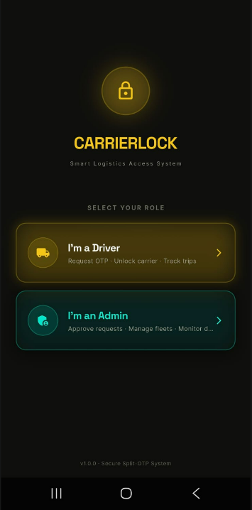
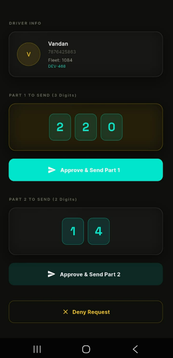
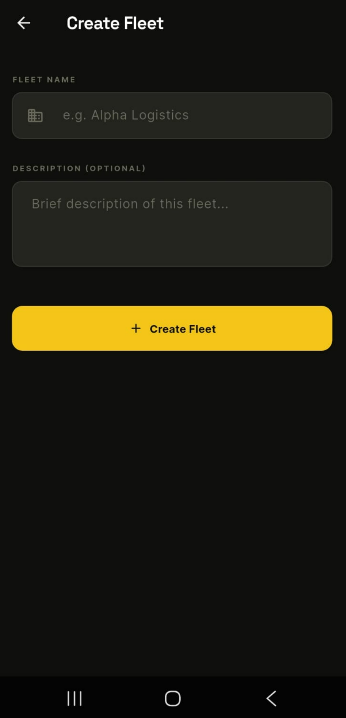
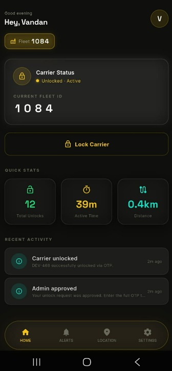
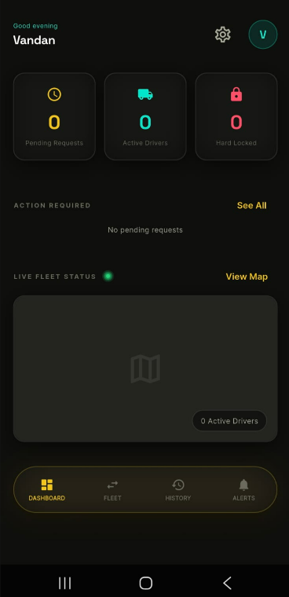
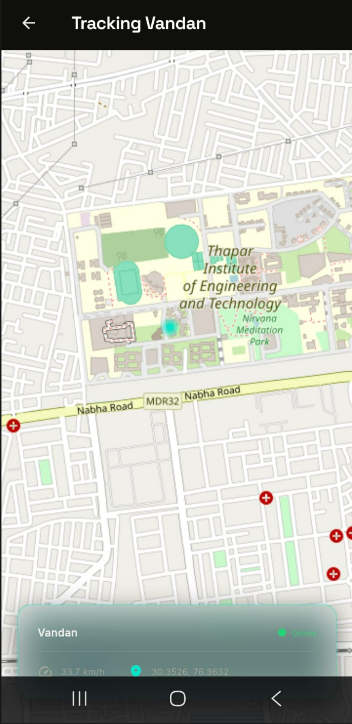
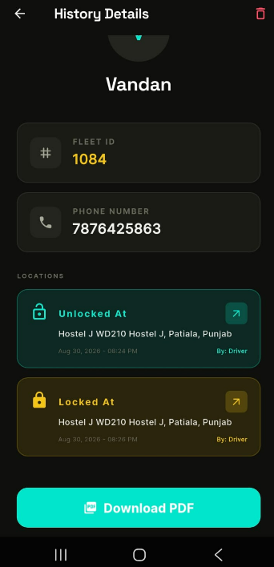
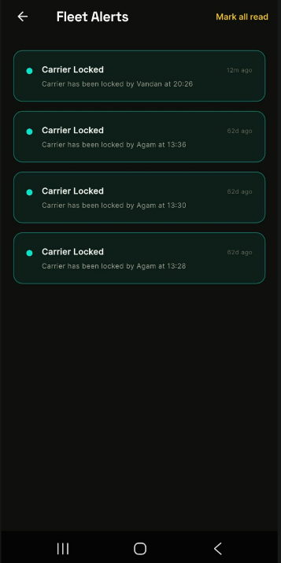

  <h1 align="center">🚚 CarrierLock</h1>

  

    <strong>Smart Logistics Access System — Split-OTP Vehicle Carrier Lock with Live Tracking</strong>
  

  

    <a href="#-overview">Overview</a> •
    <a href="#-system-capabilities">Capabilities</a> •
    <a href="#-dual-app-architecture">Architecture</a> •
    <a href="#-technology-stack">Tech Stack</a> •
    <a href="#-working-methodology">Methodology</a> •
    <a href="#-screenshots">Screenshots</a> •
    <a href="#-security">Security</a> •
    <a href="#-future-directions">Future Scope</a>
  

---

## 📘 Overview

**CarrierLock** is a dual-role logistics and fleet security application built with Flutter. It replaces manual, error-prone truck locking procedures with an automated, highly secure cryptographic OTP workflow.

The system ensures that a driver can only unlock a cargo carrier when explicitly authorized by an admin, with real-time location validation. It removes the dependency on phone calls or SMS messages by utilizing push notifications and split-OTP verification directly within the app.

---

## 🎯 Motivation

Securing high-value cargo during transit is a major challenge for logistics companies. Traditional padlock systems or simple OTP systems are vulnerable to sharing, spoofing, or driver deviation. 

CarrierLock solves this by tying cryptographic authorization to real-time geospatial data, ensuring that an unlock event only occurs exactly when and where the fleet manager authorizes it.

---

## ✨ System Capabilities

| ✅ Supported Functions | 🚫 Outside Scope |
|---|---|
| Split-OTP cryptographic unlock | Physical hardware lock integration |
| Live background location tracking | Offline-only authorization |
| Instant Push Notifications | Route planning & optimization |
| Admin fleet management dashboard | Vehicle engine immobilization |
| Hard-lock compromised devices | Driver payroll management |
| Geo-stamped lock/unlock logs | Third-party logistics API routing |

### Key Features

*   **Role-Based Access Control:** Separate optimized flows for `Admin` (Fleet Managers) and `Driver`.
*   **Live Geospatial Tracking:** Admins can view drivers on a live map in real-time.
*   **Geo-Stamped Auditing:** Every lock and unlock event captures exact GPS coordinates and timestamps.
*   **Automated Push Notifications:** Zero-friction communication between drivers requesting access and admins approving it.
*   **Emergency Hard-Lock:** Admins can instantly revoke access and lock down a driver's device remotely.

---

## 🏗 Dual-App Architecture

The system operates across two synchronized interfaces powered by a real-time database.

Driver Requests Access → Location Captured → OTP Generated (Hash stored) → Admin Notified via Push → Admin Approves → Code Pushed to Driver → Driver Unlocks Carrier

### Operational Flow

1.  **Authentication** — Secure login and fleet assignment.
2.  **Live Tracking** — Driver's background location stream begins.
3.  **Access Request** — Driver taps "Unlock", sending coordinates and request to Admin.
4.  **Admin Verification** — Admin reviews driver location on a live map and approves.
5.  **OTP Handshake** — System securely delivers the single-use unlock code to the driver.
6.  **Audit Logging** — The successful unlock is permanently logged with its geospatial signature.

---

## 🛠 Technology Stack

| Component | Technologies Used |
|---|---|
| **Framework** | Flutter (Dart) |
| **State Management** | Riverpod |
| **Navigation** | GoRouter |
| **Maps & Location** | flutter_map, Geolocator |
| **Styling & UI** | Google Fonts, flutter_animate |

*(Note: Backend configuration files have been omitted from this repository for security purposes. The application requires a standard Firebase/Firestore backend to operate.)*

---

## 📸 Screenshots

| Driver Experience | Admin Dashboard |
| :---: | :---: |
|  |  |
|  |  |
|  |  |
|  |  |

---

## 🔒 Security

*   **No Raw Passwords:** OTPs are verified via SHA-256 hashing.
*   **No API Keys Included:** All sensitive backend keys, service accounts, and database rules have been intentionally excluded from this public repository.

---

## 🔮 Future Directions

*   📦 Bluetooth Low Energy (BLE) integration with physical padlocks.
*   📱 Geofence-restricted automatic unlocking.
*   🏠 Multi-fleet hierarchy management for enterprise logistics.
*   ⚡ Offline fallback authorization via encrypted QR codes.
*   📊 Machine Learning analysis of route deviations.

---
